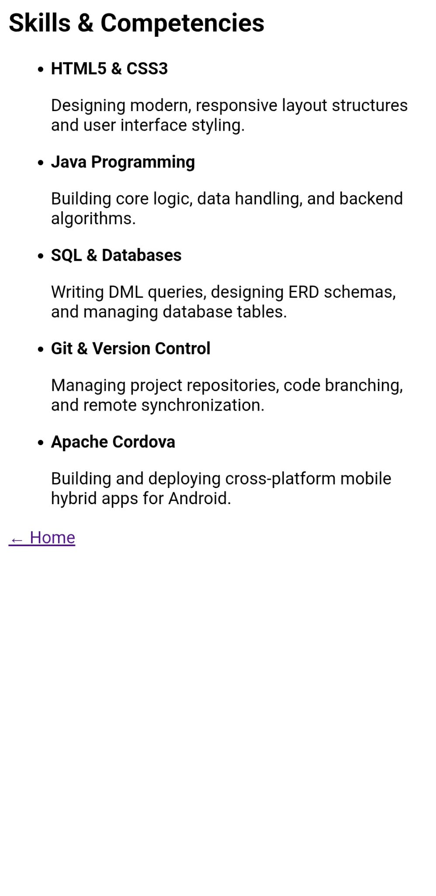
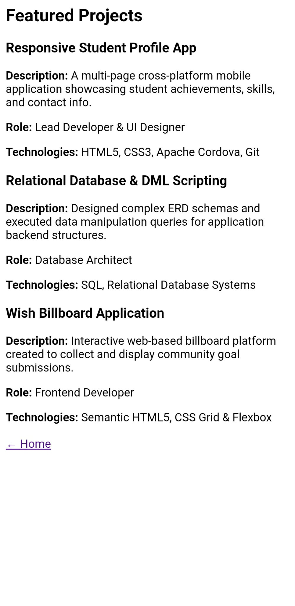

# ITCC 41 - Activity 5: Interactive Profile Editing Application

## 1. Project Description
A multi-page cross-platform mobile and web application built with **Apache Cordova** for **Dwayne B. Delos Santos**. This version introduces dynamic client-side profile editing, real-time DOM manipulation, JavaScript form validation, and persistent local storage (`localStorage`) across browser and mobile app reloads.

---

## 2. Application Pages
* **Profile (`index.html`):** The main landing interface containing the dynamic profile card, interactive display fields, and the toggleable Profile Editing form.
  
* **About (`about.html`):** Highlights personal background, education credentials, core interests, and career aspirations arranged in structured card layouts.
  
* **Skills (`skills.html`):** Itemizes technical competencies including HTML/CSS, Java programming, SQL database management, Git, and Apache Cordova.
  
* **Projects (`projects.html`):** Showcases featured software engineering projects with details on project roles, technology stacks, and operational summaries.
  
* **Contact (`contact.html`):** Provides direct channels for collaboration, professional email communication, location details, and GitHub repository links.
  

---

## 3. Profile Editing
The main profile page features a dual-mode interface:
* **Display Mode:** Renders the active profile information (Full Name, Course, Year Level, About Me, and Technical Skills).
* **Edit Form Mode:** Triggered by the "Edit Profile" button, replacing the card view with an inline form populated with current profile data.
* **Editable Fields:**
  * **Full Name:** Text input (`#input-name`)
  * **Course:** Text input (`#input-course`)
  * **Year Level:** Text input (`#input-year`)
  * **About Me:** Textarea input (`#input-about`)
  * **Skills:** Comma-separated text input (`#input-skills`)
* Users can save updates via the **Save** button or discard changes using the **Cancel** button.

---

## 4. JavaScript Functionality
Located in `www/js/index.js`, the JavaScript logic uses standard ECMAScript DOM APIs and event handling:
* **Event Listening:** Utilizes `DOMContentLoaded` to initialize data loading and attaches `click` listeners to `btn-edit`, `btn-save`, and `btn-cancel`.
* **State Toggling:** Dynamically switches visibility between `#profile-view` and `#edit-view` using CSS `display` properties.
* **Input Validation:**
  * Checks for empty or whitespace-only inputs across required fields before saving.
  * Displays inline error feedback in red (`#error-message`) if required fields are blank.
* **DOM Updating:** `loadProfile()` updates text nodes (`textContent`) dynamically without reloading the web view.

---

## 5. Local Data Storage
* **Persistence Layer:** Uses the browser `window.localStorage` API under the key `'studentProfile'`.
* **Serialization:** Profile data is serialized into JSON format using `JSON.stringify()` on save and deserialized using `JSON.parse()` on application startup.
* **Default Fallback:** If `localStorage` is empty (first run), the application automatically initializes with default values for Dwayne Delos Santos.

---

## 6. Responsive Design
The application utilizes fluid CSS media queries, CSS Grid, and Flexbox containers to adapt smoothly across all screen form factors:
* **Mobile (< 600px):** Single-column stacked layouts, touch-optimized button targets (minimum 44px height), and centered mobile cards.
* **Tablet (600px – 900px):** Reflows content into 2-column grid arrangements with flexible card containers.
* **Desktop (> 900px):** Expands to full multi-column layouts centered within a maximum container width (1200px) with generous spatial padding.

---

## 7. How to Run

### Clone the Repository:
```bash
git clone [https://github.com/delossantosdwayne8-design/ITCC41DelosSantos.git](https://github.com/delossantosdwayne8-design/ITCC41DelosSantos.git)
cd ITCC41DelosSantos