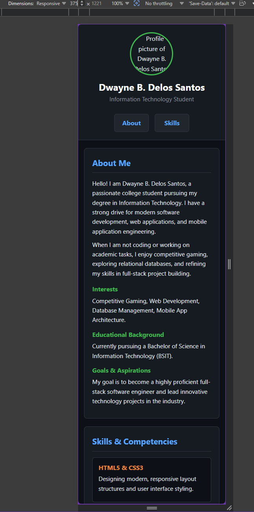
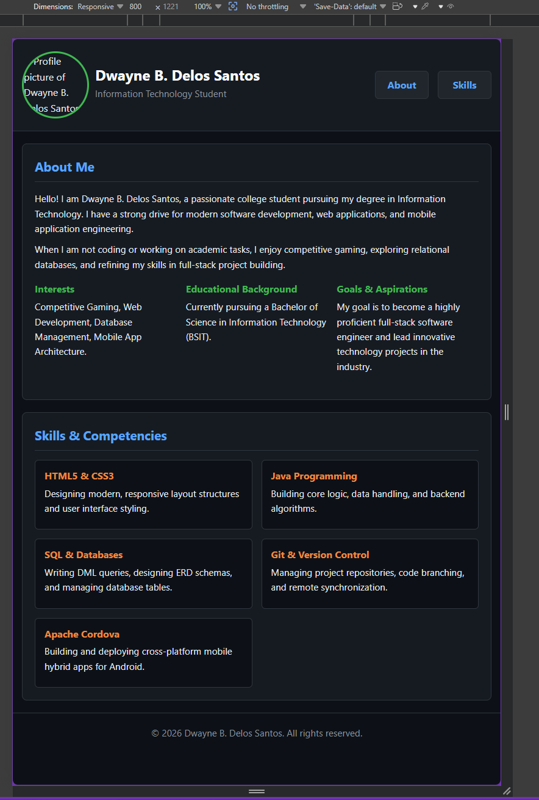
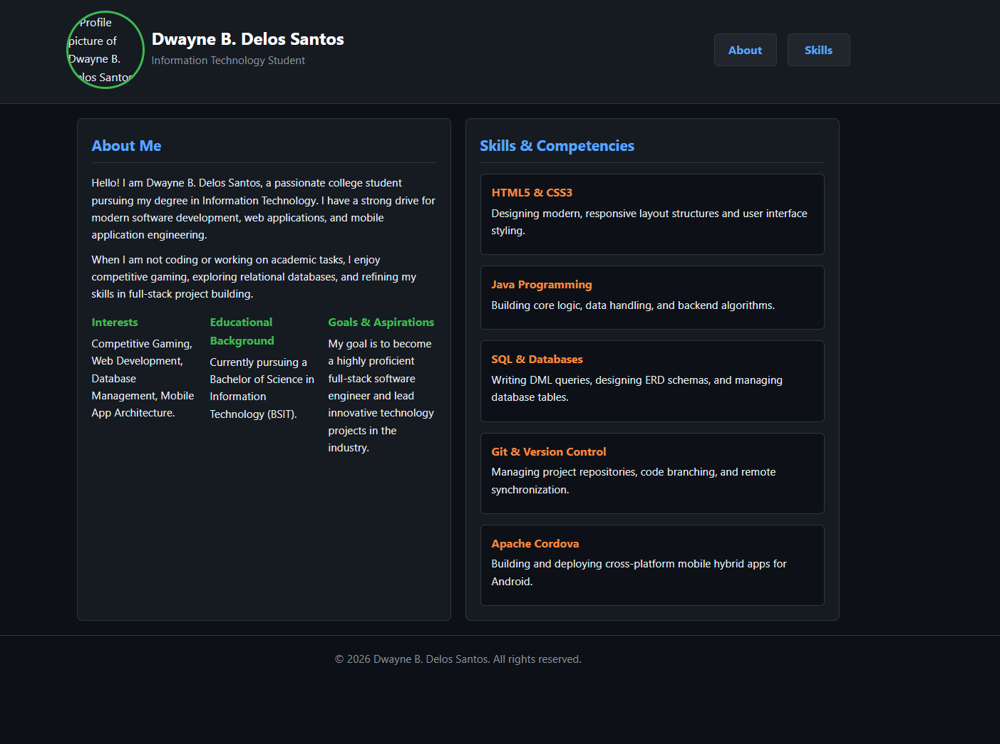
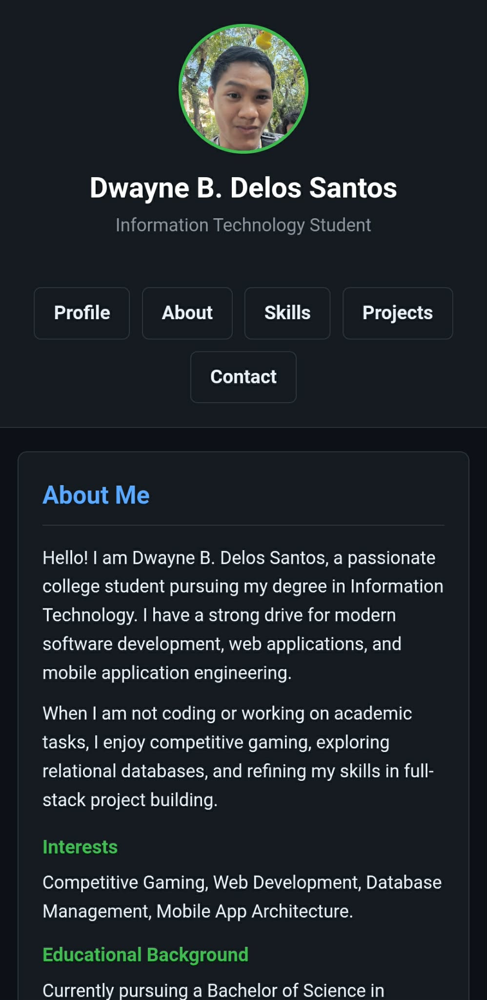

# ITCC 41 - Activity 3: Responsive Student Profile

**Student Name:** Dwayne B. Delos Santos  
**Course & Section:** BSIT - ITCC 41  

---

## Layout Screenshots

### 1. Mobile Layout


### 2. Tablet Layout


### 3. Desktop Layout


---

## Features & Improvements
- **Responsive Design:** Custom media queries adapting layout across Mobile, Tablet, and Desktop screen sizes.
- **Accessibility:** Added ARIA roles, high contrast text, and focus indicators for buttons.
- **Mobile Usability:** Configured 44px minimum touch targets and responsive flex/grid spacing.

# ITCC 41 - Activity 4: Responsive Student Profile Application

## 1. Project Description
A multi-page cross-platform mobile and web application built for Apache Cordova. This application displays the professional student profile, academic background, technical competencies, featured engineering projects, and contact information for Dwayne B. Delos Santos.

## 2. Application Pages
* **Profile (`index.html`):** Serving as the main landing UI, this page features the hero header avatar, primary overview, and high-level navigation access.

* **About (`about.html`):** Highlights personal background, education credentials, core interests, and career goals arranged in structured card layouts.

* **Skills (`skills.html`):** Itemizes technical competencies including HTML/CSS, Java programming, SQL database manipulation, Git version control, and Apache Cordova.

* **Projects (`projects.html`):** Showcases featured software engineering projects with details on project roles, technology stacks, and operational summaries.

* **Contact (`contact.html`):** Provides direct channels for collaboration, professional email communication, location, and GitHub repository links.


## 3. Navigation
Navigation is handled seamlessly across all pages via standard semantic HTML hyperlinking (`<a href="...">`). A persistent `<header>` navigation bar is embedded across every HTML document, enabling one-tap transitions between pages and quick return access to the main profile landing UI (`Profile / ← Home`).

## 4. Responsive Design
The application utilizes fluid media queries, CSS Grid, and Flexbox containers to adapt smoothly across all screen form factors:
* **Mobile (< 600px):** Elements stack vertically in a single-column layout with touch-optimized target paddings for small mobile viewports.
* **Tablet (600px – 900px):** Content cards reflow into dynamic 2-column grid arrangements to maximize screen real estate.
* **Desktop (> 900px):** Expands to full multi-column layouts with centered maximum-width containers (`1200px`) and refined spatial padding.

## 5. UI/UX Principles Applied
* **Visual Hierarchy:** Distinct headings (`<h1>`, `<h2>`, `<h3>`), high-contrast typography, and explicit section groupings guide reader focus naturally.
* **Consistency:** Universal color palettes (dark theme slate background with bold card containers), recurring typography, and identical header/footer structures across all 5 pages.
* **Accessibility:** Semantic HTML elements (`<main>`, `<header>`, `<nav>`, `<article>`), high contrast ratios for readability, and `aria-labelledby` tags on sections.
* **Touch Optimization:** Generous padding around buttons and navigation anchors tailored for native mobile touch interaction.

## 6. How to Run
To run this application locally using Apache Cordova and Android Studio:

1. **Clone the Repository:**
   ```bash
   git clone <YOUR_PUBLIC_GITHUB_REPO_LINK>
   cd <LastName>_StudentProfile