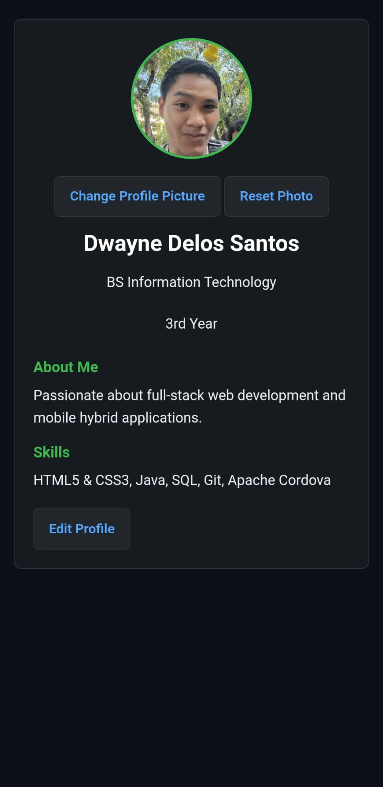
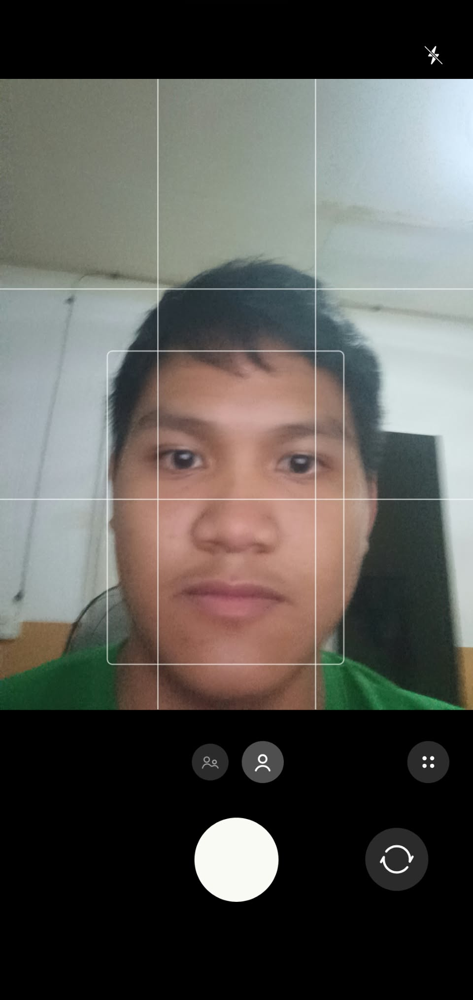
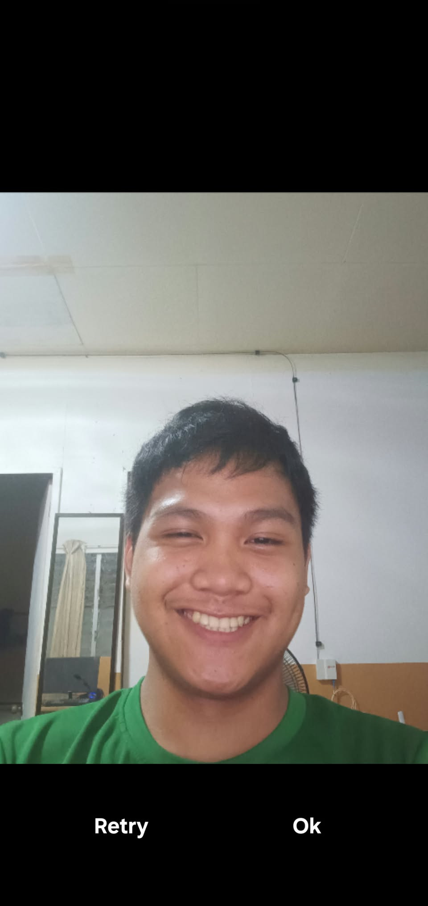
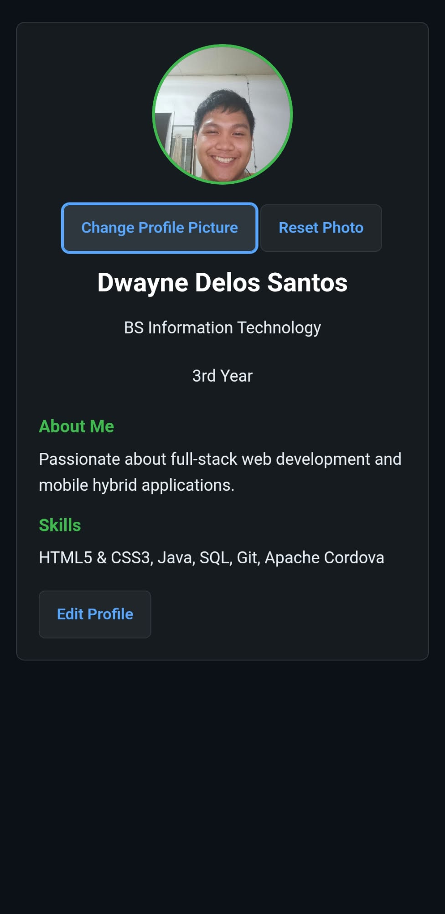

# Student Profile Application — Activity 6: Profile Picture Camera Integration

## 1. Project Description
This project is a mobile hybrid Student Profile application built using HTML5, CSS3, JavaScript, and Apache Cordova. It allows students to view, edit, and locally persist their profile information and capture/update their profile picture using native device hardware APIs.

## 2. Application Pages
* **Normal Profile (`index.html`):** The main landing interface containing the dynamic profile card, interactive display fields, and the toggleable Profile Editing form.
  
* **Changing profile with camera (`about.html`):** Highlights personal background, education credentials, core interests, and career aspirations arranged in structured card layouts.
  
* **Photo Captured (`skills.html`):** Itemizes technical competencies including HTML/CSS, Java programming, SQL database management, Git, and Apache Cordova.
  
* **Updated Profile (`projects.html`):** Showcases featured software engineering projects with details on project roles, technology stacks, and operational summaries.
  


## 3. Profile Editing
The Edit Profile module allows users to update their name, course, year, bio, and skills. Changes are validated and saved into browser `localStorage` (`studentProfile` key), ensuring data remains persistent across app restarts.

## 4. Camera Integration
The application uses the official `cordova-plugin-camera` plugin to access the device's physical camera hardware:
- **Flow:** `Change Profile Picture` / `Tap Avatar` → Open Native Camera → Capture Image → Update UI & Persist.

## 5. Device Feature Integration
Cordova serves as a bridge between the Webview (JavaScript/HTML) and native Android/iOS APIs. JavaScript calls `navigator.camera.getPicture()`, which invokes native Java code on Android to launch the system camera interface and return image data back to JavaScript asynchronously.

## 6. Image Handling
Captured images are processed as Base64-encoded JPEG strings (`DATA_URL`). The resulting string is assigned directly to the profile `` `src` attribute and saved in `localStorage` (`profileImage` key) for instant cross-session persistence.

## 7. Error Handling
- **Permission Denial / Failures:** Displays an inline feedback message: `"Unable to access the camera. Please check your device permissions."`
- **Cancellation:** If the user cancels camera capture, the app catches the cancellation notice silently, preserving the existing profile picture without crashing.
- **Validation:** Text fields in profile editing are checked before saving to prevent empty submissions.

## 8. Responsive Design
The app utilizes CSS Flexbox, Grid layout, and viewport-relative scaling with breakpoints for Mobile (<680px), Tablet (>=680px), and Desktop (>=1024px) screens. Touch targets are styled with a minimum height of 44px for accessibility.

## 9. How to Run
1. **Clone repository:**
   ```bash
   git clone [https://github.com/delossantosdwayne8-design/ITCC41DelosSantos.git](https://github.com/delossantosdwayne8-design/ITCC41DelosSantos.git)
   cd ITCC41DelosSantos